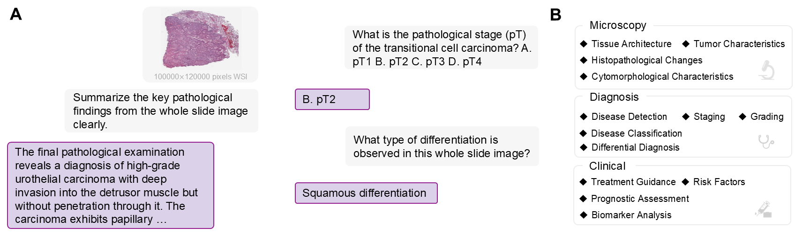
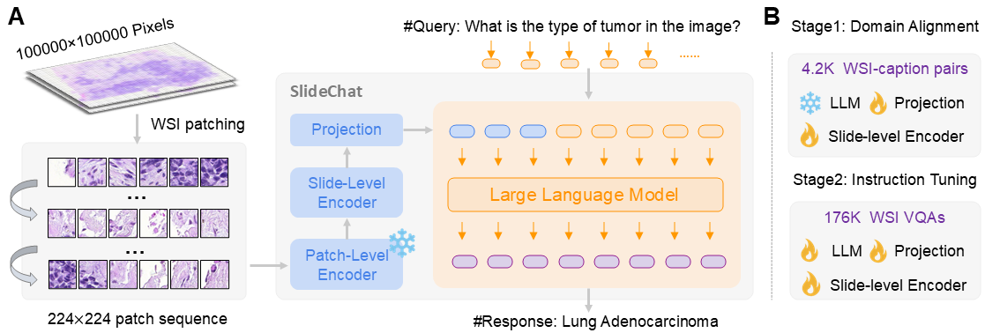

# SlideChat: A Large Vision-Language Assistant for Whole-Slide Pathology Image Understanding (CVPR2025)

[🍎 **Homepage**](https://uni-medical.github.io/SlideChat.github.io/) | [🤗 **Dataset**](https://huggingface.co/datasets/General-Medical-AI/SlideChat) | [🤗 **Model**](https://huggingface.co/General-Medical-AI/SlideChat_Weight) | [📖**Paper**](https://arxiv.org/pdf/2410.11761v1) 

**Abstract**: Despite the progress made by multimodal large language models (MLLMs) in computational pathology, they remain limited by a predominant focus on patchlevel analysis, missing essential contextual information at the whole-slide level. The lack of large-scale instruction datasets and the gigapixel scale of whole slide images (WSIs) pose significant developmental challenges. In this paper, we present SlideChat, the first vision-language assistant capable of understanding gigapixel whole-slide images, exhibiting excellent multimodal conversational capability and response complex instruction across diverse pathology scenarios. To support its development, we created SlideInstruction, the largest instructionfollowing dataset for WSIs consisting of 4.2K WSI captions and 176K VQA pairs with multiple categories. Furthermore, we propose SlideBench, a multimodal benchmark that incorporates captioning and VQA tasks to assess SlideChat’s capabilities in varied clinical settings such as microscopy, diagnosis. Compared to both general and specialized MLLMs, SlideChat exhibits exceptional capabilities, achieving state-of-the-art performance on 18 of 22 tasks.

<p align="center">
     <br>
</p>

# Update

- **🚀[2025-03-18]: We have released SlideInstruction, SlideBench and SlideChat!**
- **🚀[2025-02-27]: Accepted by CVPR2025!🌟**

# Release

We release **SlideChat**, **SlideInstruction**, and **SlideBench** as open-source resources, hoping to facilitate research and development in computational pathology.
- **SlideChat**: The first large vision-language assistant for whole-slide pathology image analysis, capable of generating comprehensive descriptions and contextually relevant responses.
- **SlideInstruction**: The largest comprehensive WSI instruction-following dataset, derived from pathology reports..
- **SlideBench**: A WSI multimodal benchmark including SlideBench-Caption, SlideBench-VQA (TCGA), and SlideBench-VQA (BCNB).  Before its final open-sourcing, SlideBench underwent a second round of expert review and filtering in collaboration with pathologists to ensure data quality.

# Usage

This project is built upon [**Xtuner**](https://github.com/InternLM/xtuner). To get started:

```bash
git clone https://github.com/uni-medical/SlideChat.git
cd SlideChat
pip install -e .
```

## Pre-requisites

Download the JSON file containing WSI IDs (TCGA) and conversation data from the [Dataset](https://huggingface.co/datasets/General-Medical-AI/SlideChat). The input image file is in CSV format and contains 512-dimensional feature representations for all patches within the WSI. Example files are provided in the ./dataset/ folder. For slide downloading and processing, please refer to [CLAM](https://github.com/mahmoodlab/CLAM) and [DSMIL](https://github.com/binli123/dsmil-wsi).

## Training

SlideChat serializes each input WSI into a sequence of patches, converting each into visual embeddings with a patch-level encoder [CONCH](https://github.com/mahmoodlab/CONCH). A slide-level encoder then interacts with these features to generate contextual embeddings. Then, a multimodal projector maps the visual features from the slide-level encoder into a unified space, aligned seamlessly with the LLM. SlideChat was trained for two stages: (1) Cross-Domain Alignment: SlideChat is trained to generate descriptive captions using 4.2K WSI-caption pairs from SlideInstruction. Specifically, only the slide-level encoder and projection are updated, while the patch-level encoder and LLM weights remain fixed; (2) Visual Instruction Learning: we utilize 176K WSI VQAs from SlideInstruction, allowing the slide encoder, projection layer, and large language model components to be fully trainable to ensure comprehensive adaptability.

<p align="center">
     <br>
</p>

Config files are in `configs/`.
```bash
xtuner train \
 <your config file path>  \
  --deepspeed <deepspeed config file path> \
  --work-dir <workdir path>

# stage1 example
xtuner train \
 configs/slidechat/stage_1.py \
  --deepspeed configs/deepspeed/deepspeed_zero2.json \
  --work-dir work_dirs/stage1

# stage2 example
xtuner train \
 configs/slidechat/stage_2.py \
  --deepspeed configs/deepspeed/deepspeed_zero2.json \
  --work-dir work_dirs/stage2
```


For a detailed explanation of the configuration file, please refer [**here**](https://xtuner.readthedocs.io/zh-cn/latest/training/modify_settings.html).
- `llm_name_or_path`: The parameter `llm_name_or_path` corresponds to the Hugging Face LLM path, such as `internlm/internlm2-chat-7b` or `Qwen/Qwen2.5-7B-Instruct` and so on.
- `data_path`: Training data (.json) path.
- `evaluation_images`: Evaluation data path.

LLAVAModel Hyperparameters:
- `freeze_llm`: Freeze the parameters of the LLM.
- `freeze_visual_encoder`: Freeze the parameters of the visual encoder.
- `pretrained_pth`: If it is the stage 2 training , it refers to the checkpoint file from stage 1 training; otherwise, it is set to `None`.
- `train_stage`: `train_stage` indicates the training phase, either Stage `'1'` or Stage `'2'`.
  

## Inference

```bash
xtuner test <your config file path> \
--checkpoint <your checkpoint path> \
--test_slide_csv  <your test file> \
--test_output_csv <result file> \
--local_rank 0

# example
xtuner test configs/slidechat/stage_2.py \
--checkpoint stage2_pth \
--test_slide_csv  SlideBench-VQA(TCGA).csv \
--test_output_csv output_my_test.csv \
--local_rank 0
```

# Contact
- Ying Chen: cying2023@stu.xmu.edu.cn
- Yuanfeng Ji: yfj@stanford.edu
- Junjun He: hejunjun@pjlab.org.cn

# Citation

**BibTeX:**

```bibtex
@article{chen2024slidechat,
  title={SlideChat: A Large Vision-Language Assistant for Whole-Slide Pathology Image Understanding},
  author={Chen, Ying and Wang, Guoan and Ji, Yuanfeng and Li, Yanjun and Ye, Jin and Li, Tianbin and and Ming, Hu and Yu, Rongshan and Qiao, Yu and He, Junjun},
  journal={arXiv preprint arXiv:2410.11761},
  year={2024}
}
```
